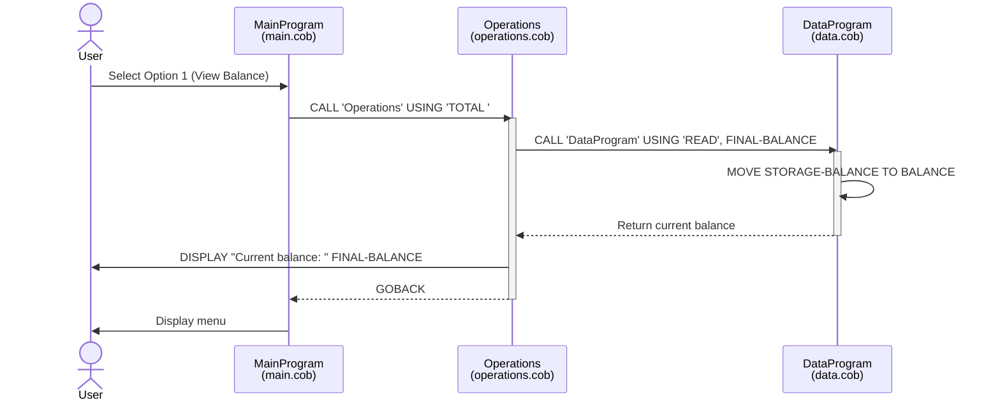
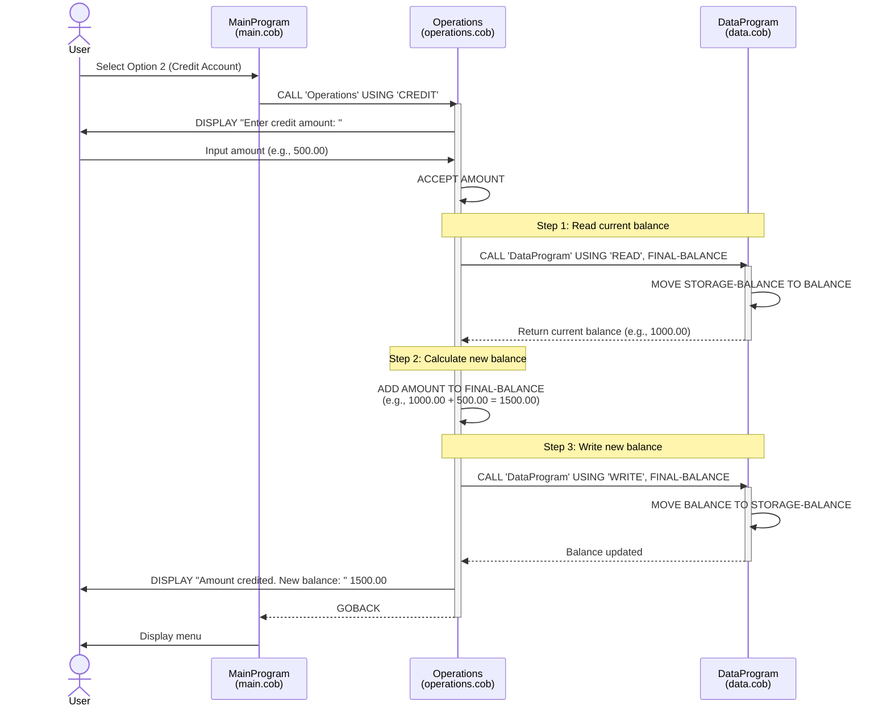
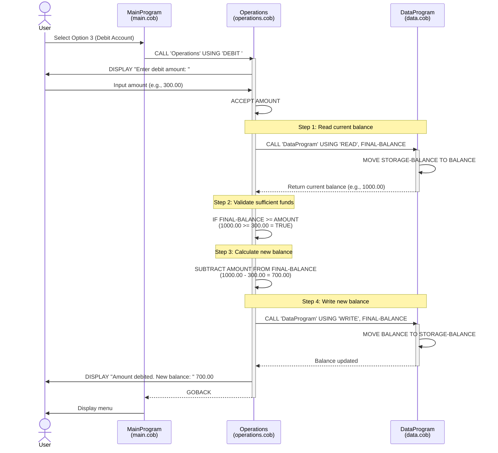
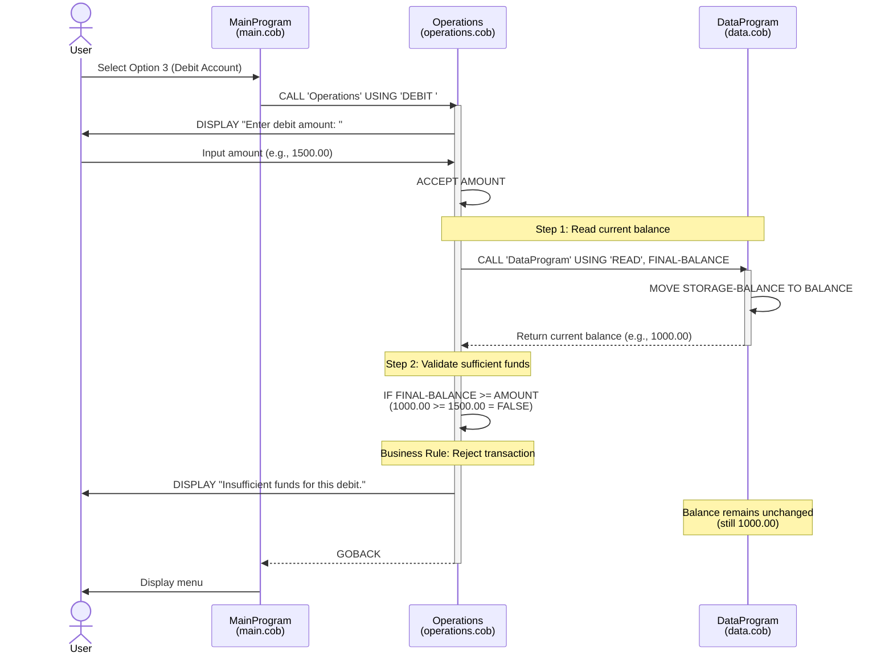
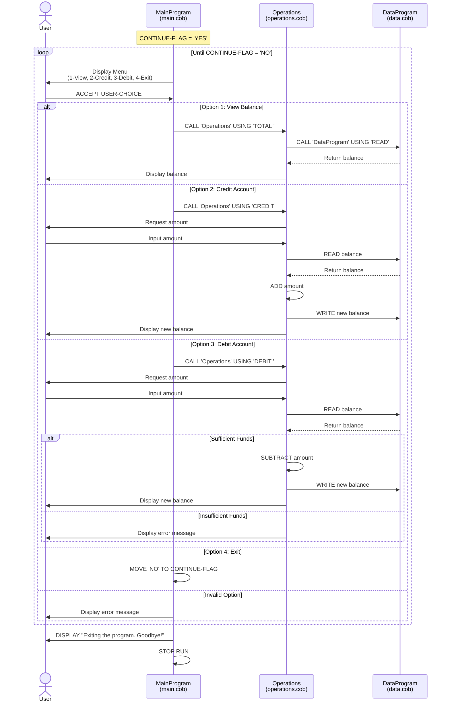

# COBOL Account Management System Documentation

## Overview

This system is a legacy COBOL application that provides basic account management functionality for student accounts. The application follows a modular design pattern with three separate COBOL programs, each handling specific responsibilities: user interface, business operations, and data management.

## System Architecture

The system uses a three-tier architecture:

- **Presentation Layer**: MainProgram (main.cob)
- **Business Logic Layer**: Operations (operations.cob)
- **Data Access Layer**: DataProgram (data.cob)

---

## COBOL Files Documentation

### 1. main.cob - MainProgram

#### Purpose

Serves as the main entry point and user interface for the Account Management System. It presents a menu-driven interface for users to interact with their student accounts.

#### Key Functions

- **Main Menu Display**: Presents four options to the user
  - View Balance (Option 1)
  - Credit Account (Option 2)
  - Debit Account (Option 3)
  - Exit (Option 4)
- **User Input Handling**: Accepts and validates user menu selections
- **Operation Routing**: Delegates operations to the Operations program based on user choice
- **Session Management**: Maintains application loop until user chooses to exit

#### Data Structures

- `USER-CHOICE`: Stores the user's menu selection (1-4)
- `CONTINUE-FLAG`: Controls the main program loop (YES/NO)

#### Program Flow

1. Display menu options
2. Accept user input
3. Evaluate choice and call appropriate operation
4. Repeat until user selects Exit
5. Display goodbye message and terminate

---

### 2. operations.cob - Operations

#### Purpose

Handles all business logic and operations related to student account transactions. Acts as the intermediary between the user interface and data storage.

#### Key Functions

##### TOTAL Operation

- **Function**: Retrieves and displays the current account balance
- **Process**:
  1. Calls DataProgram with 'READ' operation
  2. Displays the current balance to the user

##### CREDIT Operation

- **Function**: Adds funds to the student account
- **Process**:
  1. Prompts user to enter credit amount
  2. Retrieves current balance from DataProgram
  3. Adds the credit amount to the balance
  4. Writes the updated balance back to DataProgram
  5. Displays the new balance to the user

##### DEBIT Operation

- **Function**: Withdraws funds from the student account
- **Process**:
  1. Prompts user to enter debit amount
  2. Retrieves current balance from DataProgram
  3. **Validates sufficient funds** (business rule enforcement)
  4. If sufficient: Subtracts amount and updates balance
  5. If insufficient: Displays error message and maintains current balance
  6. Displays result to the user

#### Data Structures

- `OPERATION-TYPE`: Stores the type of operation (TOTAL/CREDIT/DEBIT)
- `AMOUNT`: Stores transaction amount (up to 999,999.99)
- `FINAL-BALANCE`: Working variable for balance calculations

---

### 3. data.cob - DataProgram

#### Purpose

Manages data persistence and storage for student account balances. Provides a simple data access interface with read and write operations.

#### Key Functions

##### READ Operation

- **Function**: Retrieves the current stored balance
- **Process**: Moves STORAGE-BALANCE to the passed BALANCE parameter

##### WRITE Operation

- **Function**: Persists an updated balance value
- **Process**: Moves the passed BALANCE parameter to STORAGE-BALANCE

#### Data Structures

- `STORAGE-BALANCE`: Persistent storage for account balance (initialized to 1000.00)
- `OPERATION-TYPE`: Determines whether to READ or WRITE data

---

## Business Rules for Student Accounts

### 1. Initial Balance

- **Rule**: All student accounts start with an initial balance of $1,000.00
- **Implementation**: Defined in DataProgram's STORAGE-BALANCE initialization

### 2. Balance Format

- **Rule**: Balances are stored with precision of 6 digits before decimal and 2 after
- **Maximum Balance**: $999,999.99
- **Data Type**: `PIC 9(6)V99` format in COBOL

### 3. Insufficient Funds Protection

- **Rule**: Debit operations cannot exceed the current account balance
- **Implementation**: Operations program validates balance before processing debit
- **User Feedback**: "Insufficient funds for this debit." message displayed when validation fails
- **Result**: Transaction is rejected and balance remains unchanged

### 4. Transaction Amounts

- **Rule**: Credit and debit amounts follow the same format as balance
- **Maximum Transaction**: $999,999.99
- **Minimum Transaction**: $0.01 (implied by format)

### 5. Data Integrity

- **Rule**: Balance updates are atomic operations
- **Implementation**: READ-MODIFY-WRITE pattern ensures consistency
- **Process**:
  1. Read current balance
  2. Perform calculation
  3. Write new balance

### 6. Operation Codes

- **Rule**: Operations use fixed 6-character codes with trailing spaces
- **Valid Codes**:
  - `'TOTAL '` - View balance
  - `'CREDIT'` - Add funds
  - `'DEBIT '` - Withdraw funds
  - `'READ'` - Internal data read
  - `'WRITE'` - Internal data write

---

## System Limitations

1. **Single Account**: System currently handles only one student account at a time
2. **No Persistence**: Balance resets to initial value ($1,000) on program restart
3. **No Audit Trail**: Transactions are not logged or tracked historically
4. **No Authentication**: No user verification or account identification
5. **Synchronous Processing**: All operations are processed sequentially
6. **Limited Validation**: No validation for negative amounts or non-numeric input

---

## Technical Notes

### Program Communication

- Programs communicate using COBOL's `CALL...USING` mechanism
- Parameters are passed by reference through the LINKAGE SECTION
- All called programs return control using `GOBACK` statement

### Error Handling

- Basic validation for menu choices (1-4 only)
- Insufficient funds validation for debit operations
- Invalid input displays error message and re-prompts user

### Data Types

- All monetary values use `PIC 9(6)V99` (implied decimal)
- Operation codes use `PIC X(6)` (alphanumeric, 6 characters)
- User choice uses `PIC 9` (single digit numeric)

---

## Future Enhancement Opportunities

1. **Multi-Account Support**: Add student ID and account management
2. **Database Integration**: Replace in-memory storage with persistent database
3. **Transaction History**: Implement audit log for all operations
4. **Enhanced Validation**: Add comprehensive input validation
5. **Security**: Implement authentication and authorization
6. **Reporting**: Add account statements and transaction reports
7. **Concurrency**: Handle multiple simultaneous users
8. **API Integration**: Expose functionality through modern APIs

---

## Modernization Considerations

This legacy COBOL system is a candidate for modernization. Potential approaches include:

- **Rewrite**: Port to modern languages (Java, Python, JavaScript/Node.js)
- **Wrap**: Create API wrappers around existing COBOL modules
- **Replace**: Migrate to modern banking/account management platforms
- **Refactor**: Modernize COBOL code while maintaining the language

Each approach should consider the business rules documented here to ensure feature parity and regulatory compliance.

---

## System Data Flow Diagrams

### View Balance Operation (Option 1)

### Credit Account Operation (Option 2)

### Debit Account Operation - Successful (Option 3)

### Debit Account Operation - Insufficient Funds (Option 3)

### Complete Application Flow

---

## Key Data Flow Patterns

### Read-Modify-Write Pattern
All balance-modifying operations (Credit and Debit) follow this atomic pattern:
1. **Read** current balance from DataProgram
2. **Modify** balance in Operations (add or subtract)
3. **Write** new balance back to DataProgram

This ensures data consistency and prevents race conditions in the single-threaded environment.

### Validation Before Modification
The Debit operation implements business rule validation:
- Balance is read **before** attempting modification
- Validation occurs **before** calculation
- Write operation only executed if validation passes

### Separation of Concerns
The sequence diagrams clearly show the three-tier separation:
- **MainProgram**: User interaction and menu control
- **Operations**: Business logic and validation
- **DataProgram**: Data storage and retrieval

This modular design facilitates future modernization efforts by providing clear boundaries between system components.
